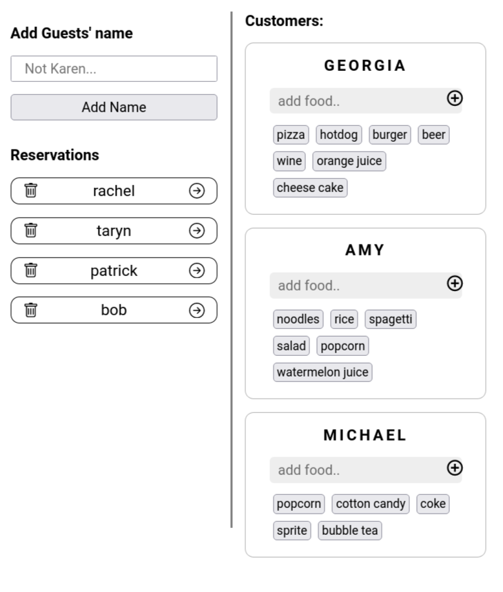

## DESCRIPTION:
- A "restaurant reservation app, made with React + Redux Toolkit.
- [Youtube Video of the App](https://youtu.be/rmOvq94qhOo)

## OUTCOME:
### VERSION 1 (branch: main)
- React-Redux-Toolkit "Restaurant Reservation App"
- link to the App's video on youtube: https://youtu.be/rmOvq94qhOo

## TECH STACKS:
- React,
- Redux Toolkit, React-redux.
- React Hooks: useState, 
- React Icons
- styling: Styled Components.

## PROGRESS:
- version 1: 100%;

## How to run
`yarn install`
`yarn start`

## View other projects:
- [My Blog](https://hashnode.com/@marizoo)
- [My Pinterest](https://pin.it/16vGwjy)
- [My Youtube Channel](https://www.youtube.com/channel/UCfkbnM9WvHD3mjecBiGHCBQ/playlists)

## IMAGE:
